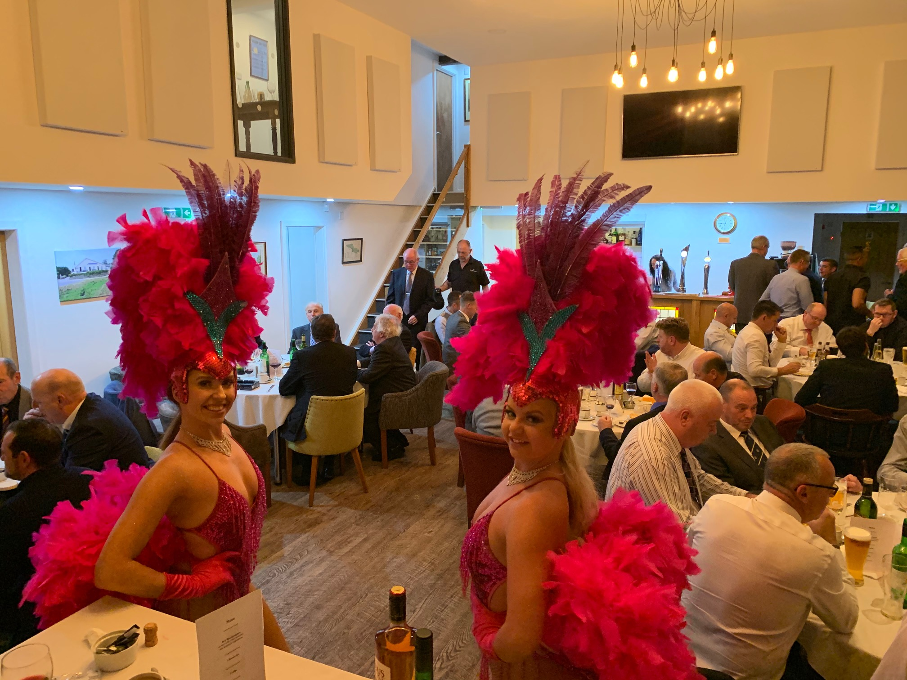

Intro about the annual calendar.

<h2>Pre Year</h2>

<h3>October</h3>
Happening: Annual Medal & Stableford  
Initiate: Car Park Draw  
Deadline: Prepare your calendar for the following year

<h3>November</h3>
Happening: BDUGC Alliance
Initiate:  
Deadline:  
Deadline to prepare speech for AGM
Attend club dinner

<h2>Year in Office</h2>

<h3>December</h3>
Happening:
* Kids Christmas Party / Car Park Draw
* AGM
* First Booking on  
Initiate:  
Deadline: confirm arrangements for Captain's Drive in

<h3>January</h3>
Happening: 
* Captain's Drive in
* BDUGC Annual Dinner  
Initiate:  
Deadline: 
* Mid Jan Book table for BDUGC Annual Dinner 
* Signing up to Daily Mail Foursomes

<h3>February</h3>
Happening: 
* Past Captains' Dinner
* BDUGC Alliance   
Initiate: Advertise Enrolment Night   
Deadline:

<h3>March</h3>
Happening: 
* Section Enrolment Night
* Cheltenham Open Day
* End of Winter League
Initiate: Masters Team Comp Sign up sheet  
Deadline:
Section Sign up

<h3>April</h3>
Happening:
* Masters Team Club
* Start of Qualifying Season   
Initiate:   
Deadline:  
Qualifying Season

<h3>May</h3>
Happening:  
Initiate:  
Deadline:
Club Cup Qualifier

<h3>June</h3>
Happening:   
Initiate:   
Deadline: 

<h3>July</h3>
Happening:   
Initiate:   
Deadline: 

<h3>August</h3>
Happening:   
Initiate:   
Deadline: 

<h3>September</h3>
Happening:   
Initiate:   
Deadline: 
Finals Day

<h3>October</h3>
Happening:   
Initiate:   
Deadline: 
* Annual Finals
* Whisky Trot
*Turkey Trot

<h3>November</h3>
Happening:
Initiate:
Deadline:
Club Dinner

<h3>December</h3>
Happening: AGM
Initiate:
Deadline:
AGM

<h2>Post Year</h2>
<h3>January</h3>
Happening:
Initiate:
Deadline:

<h3>Febraury</h3>
Happening:
Initiate:
Deadline:

<h3>September</h3>
Happening:
Initiate:
Deadline: